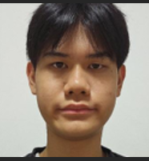
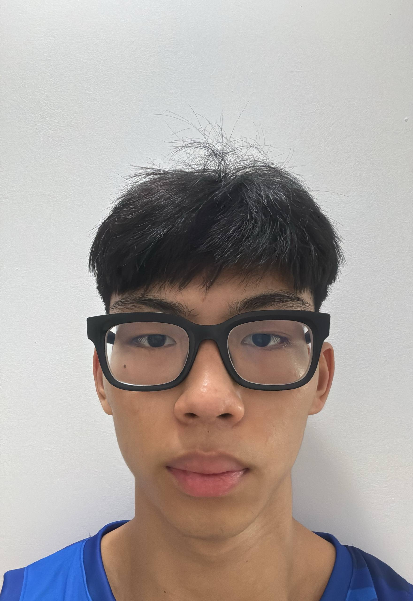
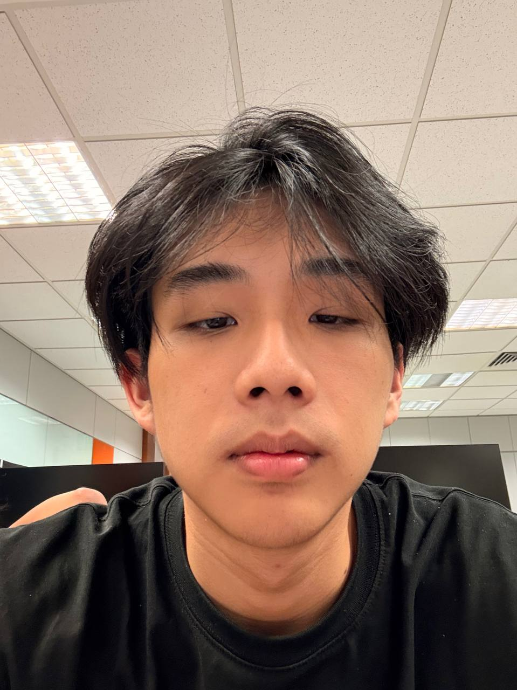
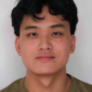

# About Us

We are a team based in the [School of Computing, National University of Singapore](http://www.comp.nus.edu.sg).

You can reach us at the email `seer[at]comp.nus.edu.sg`

## Project team

### Clement Sim

[[homepage](http://www.comp.nus.edu.sg/~damithch)]
[[github](https://github.com/clementsimwj)]
[[portfolio](team/johndoe.md)]

* Role: Project Advisor

### Ang Tze Haw Bryan

[[github](https://github.com/brainybryan69)]
[[portfolio](team/brainybryan69.md)]

* Role: Team member
* Responsibilities: UI

### Nathan

[[github](http://github.com/ludannnn)] [[portfolio](team/johndoe.md)]

* Role: Developer
* Responsibilities: Ui, team motivator, team reminder

### Benjamin Seah

[[github](http://github.com/briesciongit )]
[[portfolio](team/johndoe.md)]

* Role: Developer
* Responsibilities: Dev Ops + Threading

### Anand Bala

[[github](http://github.com/anand2273)]
[[portfolio](team/anand2273.md)]

* Role: Developer
* Responsibilities: UI
