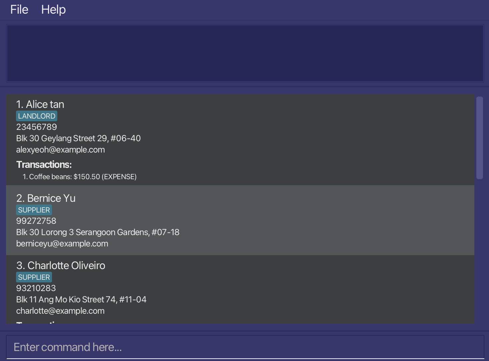

# Atlas User Guide

Atlas is a **desktop app for managing contacts and transactions for F&B business owners, optimized for use via a Command Line Interface** (CLI) while still having the benefits of a Graphical User Interface (GUI). If you can type fast, Atlas can get your contact and transaction management tasks done faster than traditional GUI apps.

<!-- * Table of Contents -->
<page-nav-print />

--------------------------------------------------------------------------------------------------------------------

## Quick start

1. Ensure you have Java `17` or above installed in your Computer. 
   **Mac users:** Ensure you have the precise JDK version prescribed [here](https://se-education.org/guides/tutorials/javaInstallationMac.html).

2. Download the latest `.jar` file from [here](https://github.com/se-edu/addressbook-level3/releases).

3. Copy the file to the folder you want to use as the _home folder_ for Atlas.

4. Open a command terminal, `cd` into the folder you put the jar file in, and use the `java -jar addressbook.jar` command to run the application. 
   A GUI similar to the below should appear in a few seconds. Note how the app contains some sample data. 
   

5. Type the command in the command box and press Enter to execute it. e.g. typing **`help`** and pressing Enter will open the help window. 
   Some example commands you can try:

    * `list` : Lists all contacts.

    * `add n/John Doe p/98765432 e/johnd@example.com` : Adds a contact named `John Doe` to Atlas.

    * `addtxn i/1 n/Coffee beans a/-50` : Adds an expense transaction to the 1st contact.

    * `delete 3` : Deletes the 3rd contact shown in the current list.

    * `clear` : Deletes all contacts.

    * `exit` : Exits the app.

6. Refer to the [Features](#features) below for details of each command.

--------------------------------------------------------------------------------------------------------------------

## Features

<box type="info" seamless>

**Notes about the command format:** 

* Words in `UPPER_CASE` are the parameters to be supplied by the user. 
  e.g. in `add n/NAME`, `NAME` is a parameter which can be used as `add n/John Doe`.

* Items in square brackets are optional. 
  e.g `n/NAME [t/TAG]` can be used as `n/John Doe t/friend` or as `n/John Doe`.

* Items with `…`​ after them can be used multiple times including zero times. 
  e.g. `[t/TAG]…​` can be used as ` ` (i.e. 0 times), `t/friend`, `t/friend t/family` etc.

* Parameters can be in any order. 
  e.g. if the command specifies `n/NAME p/PHONE_NUMBER`, `p/PHONE_NUMBER n/NAME` is also acceptable.

* Extraneous parameters for commands that do not take in parameters (such as `help`, `list`, `exit` and `clear`) will be ignored. 
  e.g. if the command specifies `help 123`, it will be interpreted as `help`.

* If you are using a PDF version of this document, be careful when copying and pasting commands that span multiple lines as space characters surrounding line-breaks may be omitted when copied over to the application.
  </box>

### General Commands

#### Viewing help : `help`

Shows a message explaining how to access the help page.

Format: `help`

#### Clearing all entries : `clear`

Clears all entries from the address book.

Format: `clear`

#### Exiting the program : `exit`

Exits the program.

Format: `exit`

### Person Management Commands

#### Adding a person: `add`

Adds a person to Atlas.

Format: `add n/NAME p/PHONE_NUMBER e/EMAIL [a/ADDRESS] [t/TAG]…​`

* `NAME`, `PHONE_NUMBER`, and `EMAIL` are **required fields**.
* `ADDRESS` is **optional**. You can add contacts without an address.
* Phone numbers must contain at least 3 digits.

<box type="tip" seamless">

**Tip:** A person can have any number of tags (including 0). Tags help you categorize your contacts (e.g., supplier, customer, VIP).

**Note:** A person cannot be added if another contact already exists with the **same name AND either the same phone number or the same email address**.
</box>

Examples:
* `add n/John Doe p/98765432 e/johnd@example.com a/John street, block 123, #01-01`
* `add n/Betsy Crowe p/1234567 e/betsycrowe@example.com t/friend t/supplier`
* `add n/Alex Supplier p/91234567 e/alex@supplier.com` (without address)

#### Listing all persons : `list`

Shows a list of all persons in the address book.

Format: `list`

#### Editing a person : `edit`

Edits an existing person in the address book.

Format: `edit INDEX [n/NAME] [p/PHONE] [e/EMAIL] [a/ADDRESS] [t/TAG]…​`

* Edits the person at the specified `INDEX`. The index refers to the index number shown in the displayed person list. The index **must be a positive integer** 1, 2, 3, …​
* At least one of the optional fields must be provided.
* Existing values will be updated to the input values.
* When editing tags, the existing tags of the person will be removed i.e adding of tags is not cumulative.
* You can remove all the person's tags by typing `t/` without
  specifying any tags after it.

Examples:
*  `edit 1 p/91234567 e/johndoe@example.com` Edits the phone number and email address of the 1st person to be `91234567` and `johndoe@example.com` respectively.
*  `edit 2 n/Betsy Crower t/` Edits the name of the 2nd person to be `Betsy Crower` and clears all existing tags.

#### Locating persons by name: `find`

Finds persons whose names contain any of the given keywords.

Format: `find KEYWORD [MORE_KEYWORDS]`

* The search is case-insensitive. e.g `hans` will match `Hans`
* The order of the keywords does not matter. e.g. `Hans Bo` will match `Bo Hans`
* Only the name is searched.
* Only full words will be matched e.g. `Han` will not match `Hans`
* Persons matching at least one keyword will be returned (i.e. `OR` search).
  e.g. `Hans Bo` will return `Hans Gruber`, `Bo Yang`

Examples:
* `find John` returns `john` and `John Doe`
* `find alex david` returns `Alex Yeoh`, `David Li` 

#### Deleting a person : `delete`

Deletes the specified person from the address book.

Format: `delete INDEX`

* Deletes the person at the specified `INDEX`.
* The index refers to the index number shown in the displayed person list.
* The index **must be a positive integer** 1, 2, 3, …​

Examples:
* `list` followed by `delete 2` deletes the 2nd person in the address book.
* `find Betsy` followed by `delete 1` deletes the 1st person in the results of the `find` command.

### Transaction Management Commands

#### Adding a transaction : `addtxn`

Adds a transaction to a specified contact. Useful for tracking purchases from suppliers or sales to customers.

Format: `addtxn i/PERSON_INDEX n/TRANSACTION_NAME a/AMOUNT`

* Adds a transaction to the contact at the specified `PERSON_INDEX`.
* The `AMOUNT` determines the transaction type:
    * **Positive amount** (e.g., `50`) = INCOME transaction
    * **Negative amount** (e.g., `-50`) = EXPENSE transaction
* The amount cannot be zero.
* All transactions are saved automatically and will persist after restarting the app.

<box type="info" seamless>

**Note:** Transactions are displayed on the contact card below their email address.
</box>

Examples:
* `addtxn i/1 n/Coffee beans a/-150.50` - Adds an expense of $150.50 for coffee beans to contact #1
* `addtxn i/2 n/Monthly payment a/500` - Adds an income of $500 for monthly payment to contact #2
* `addtxn i/3 n/Equipment purchase a/-2000` - Adds an expense of $2000 for equipment to contact #3

#### Deleting a transaction : `deletetxn`

Deletes a specified transaction from a contact.

Format: `deletetxn i/PERSON_INDEX t/TRANSACTION_INDEX`

* Deletes the transaction at `TRANSACTION_INDEX` from the person at `PERSON_INDEX`.
* The person index refers to the index shown in the displayed person list.
* The transaction index refers to the transaction number shown on the person's card (starting from 1).
* Both indices **must be positive integers** 1, 2, 3, …​

Examples:
* `deletetxn i/1 t/2` - Deletes the 2nd transaction from the 1st contact
* `deletetxn i/3 t/1` - Deletes the 1st transaction from the 3rd contact

### Data Management

#### Saving the data

Atlas data (including all contacts and transactions) are saved in the hard disk automatically after any command that changes the data. There is no need to save manually.

#### Editing the data file

Atlas data are saved automatically as a JSON file `[JAR file location]/data/addressbook.json`. Advanced users are welcome to update data directly by editing that data file.

<box type="warning" seamless>

**Caution:**
If your changes to the data file makes its format invalid, Atlas will discard all data and start with an empty data file at the next run. Hence, it is recommended to take a backup of the file before editing it. 
Furthermore, certain edits can cause Atlas to behave in unexpected ways (e.g., if a value entered is outside the acceptable range). Therefore, edit the data file only if you are confident that you can update it correctly.
</box>

#### Archiving data files `[coming in v2.0]`

_Details coming soon ..._

--------------------------------------------------------------------------------------------------------------------

## FAQ

**Q**: How do I transfer my data to another Computer? 
**A**: Install the app in the other computer and overwrite the empty data file it creates with the file that contains the data of your previous Atlas home folder.

**Q**: What happens if I try to add a person with the same name? 
**A**: Atlas will reject the addition and show an error message. Each person must have a unique name.

**Q**: Can I add a contact without an address? 
**A**: Yes! Only name, phone number, and email are required. Address is optional.

**Q**: How do I view my transactions? 
**A**: Transactions are automatically displayed on each person's contact card in the main list view.

--------------------------------------------------------------------------------------------------------------------

## Known issues

1. **When using multiple screens**, if you move the application to a secondary screen, and later switch to using only the primary screen, the GUI will open off-screen. The remedy is to delete the `preferences.json` file created by the application before running the application again.
2. **If you minimize the Help Window** and then run the `help` command (or use the `Help` menu, or the keyboard shortcut `F1`) again, the original Help Window will remain minimized, and no new Help Window will appear. The remedy is to manually restore the minimized Help Window.

--------------------------------------------------------------------------------------------------------------------

## Command summary

### General Commands

Action     | Format, Examples
-----------|------------------
**Help**   | `help`
**Clear**  | `clear`
**Exit**   | `exit`

### Person Management Commands

Action       | Format, Examples
-------------|----------------------------------------------------------------------------------------------------------------------------------------------------------------------
**Add**      | `add n/NAME p/PHONE_NUMBER e/EMAIL [a/ADDRESS] [t/TAG]…​`   e.g., `add n/James Ho p/22224444 e/jamesho@example.com t/supplier`
**List**     | `list`
**Edit**     | `edit INDEX [n/NAME] [p/PHONE] [e/EMAIL] [a/ADDRESS] [t/TAG]…​`  e.g.,`edit 2 n/James Lee e/jameslee@example.com`
**Find**     | `find KEYWORD [MORE_KEYWORDS]`  e.g., `find James Jake`
**Delete**   | `delete INDEX`  e.g., `delete 3`

### Transaction Management Commands

Action                 | Format, Examples
-----------------------|----------------------------------------------------------------------------------------------------------------------------------------------------------------------
**Add Transaction**    | `addtxn i/PERSON_INDEX n/TRANSACTION_NAME a/AMOUNT`   e.g., `addtxn i/1 n/Coffee beans a/-150.50`
**Delete Transaction** | `deletetxn i/PERSON_INDEX t/TRANSACTION_INDEX`   e.g., `deletetxn i/1 t/2`