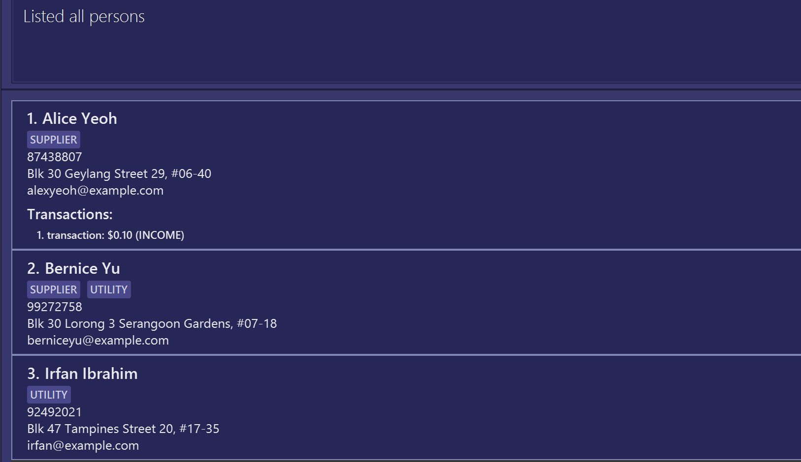

# Atlas User Guide

## What is Atlas?

Running an F&B business means juggling relationships with suppliers, customers, and partners — all while keeping track of countless orders, payments, and deliveries.

Atlas helps you stay on top of it all.

Built specifically for **F&B business owners**, Atlas is a **desktop app** designed to streamline your daily operations through:

1. **👥 Contact Management** – Keep detailed records of your suppliers, customers, and other key stakeholders in one organized place.

2. **💳 Transaction Handling** – Record and monitor all transactions with each contact — from ingredient purchases to customer payments — for clear, effortless tracking.

3. **🔔 Follow-Up Management** – Never miss a payment, delivery, or client check-in again with built-in reminders and follow-up tracking for every contact.

With Atlas, you can cut through the clutter of admin work and focus on running and growing your F&B business with confidence.

*Atlas – Your Recipe for Faster, Smarter F&B Management*

<!-- * Table of Contents -->
<page-nav-print />

--------------------------------------------------------------------------------------------------------------------

## Table of contents
- [Quick Start](#quick-start)
- [Features](#features)
- 

  
General Commands

    - [Viewing help : `help`](#viewing-help-help)
    - [Clearing all entries : `clear`](#clearing-all-entries-clear)
    - [Exiting the program : `exit`](#exiting-the-program-exit)
    - [Checking net cashflow: `summary`](#checking-net-cashflow-summary)
  

- 

  
Person Management Commands

    - [Adding a person: `add`](#adding-a-person-add)
    - [Listing all persons : `list`](#listing-all-persons-list)
    - [Editing a person : `edit`](#editing-a-person-edit)
    - [Locating persons by name: `find`](#locating-persons-by-name-find-n)
    - [Locating persons by tag: `find t/`](#locating-persons-by-tag-find-t)
    - [Locating persons by name AND tag: `find n/ t/`](#locating-persons-by-name-and-tag-find-n-t-)
    - [Deleting a person : `delete`](#deleting-a-person-delete)
  

- 

  
Transaction Management Commands

    - [Adding a transaction : `addtxn`](#adding-a-transaction-addtxn)
    - [Deleting a transaction : `deletetxn`](#deleting-a-transaction-deletetxn)
    - [Editing a transaction : `editTxn`](#editing-a-transaction-edittxn)
  

- 

  
Follow-up Management Commands

    - [Adding a follow-up : `addfu`](#adding-a-follow-up-addfu)
    - [Deleting a follow-up : `deletefu`](#deleting-a-follow-up-deletefu)
  

- 

  
Data Management

  
    - [Archiving data files : `archive`](#archiving-data-files-archive)
    - [Unarchive data files : `unarchive`](#unarchive-data-files-unarchive)

  

- 

  
Additional Information

  
    - [Index Numbers](#index-numbers)
    - [Valid Tags](#valid-tags)
    - [Transaction Amounts](#transaction-amounts)
    - [Duplicate Stakeholders](#duplicate-stakeholders)
    - [Saving the data](#saving-the-data)
    - [Editing the data file](#editing-the-data-file)
  

- [FAQ](#faq)
- [Known Issues](#known-issues)
- [Command Summary](#command-summary)

--------------------------------------------------------------------------------------------------------------------

## Quick Start

1. Ensure you have Java `17` or above installed in your Computer. 
   **Mac users:** Ensure you have the precise JDK version prescribed [here](https://se-education.org/guides/tutorials/javaInstallationMac.html).
    

   
Checking Java Version

   <ul>
        <li> Open Command Prompt (Windows)/ Terminal (MacOS)</li>
        <li> Run the Command: <code>java -version</code></li>
        <li> If you have Java <code>17</code> or above installed, the following output will be returned:  
            

                
                

                    <em>Figure: Output at Command Terminal indicating Java 17 or above</em>
                

            

        </li>
   </ul>
    

2. Download the latest `.jar` file from [here](https://github.com/AY2526S1-CS2103T-W13-3/tp/releases).

3. Create a folder in your computer for your application (Preferably *Desktop*).

4. Copy the file to the folder you have created (This will be the _home folder_ for Atlas).

5. Open the home folder using the command terminal.
   

   
Windows User:

        Right-click on your home folder and select <code>Open in Terminal</code> 
        

            
                

                    <em>Figure: Option to Open in Terminal for Windows</em>
                

        

    

   

   
MacOS User:

        Right-click on your home folder and select <code>New Terminal at Folder</code> 
        

            
                

                    <em>Figure: Option to Open in Terminal for MacOS</em>
                

        

    

   

6. Run: `java -jar atlas.jar` to run the application. 
   A GUI similar to the below should appear in a few seconds. Note how the app contains some sample data: 
   

     
    

        <em>Figure: UI of Atlas upon Application Start</em>
    

   
 

7. Type the command in the command box and press `Enter` to execute it. e.g. typing **`help`** and pressing Enter will open the help window. 
   Some example commands you can try:

    * `list` : Lists all stakeholder contacts (i.e suppliers, landlords, delivery personnel, etc).

    * `add n/John Doe p/98765432 e/johnd@example.com` : Adds an unspecified stakeholder named `John Doe` to Atlas.

    * `addtxn i/1 n/Coffee beans a/-50` : Adds an expense transaction to the 1st stakeholder.

    * `delete 3` : Deletes the 3rd stakeholder shown in the current list.

    * `exit` : Exits the app.

8. Refer to the [Features](#features) below for details of each command.

[↩️ Back to Table of Contents](#table-of-contents)

--------------------------------------------------------------------------------------------------------------------

## Features
Every feature in Atlas is designed around the real needs of F&B business owners — where efficiency, organisation, and relationships matter most.
Each feature is represented by a command, allowing you to perform actions quickly and consistently.

Atlas’ capabilities can be grouped into five key categories, each addressing a specific aspect of running your business:

1. ⚙️ [General Commands](#general-commands): 
Handle your everyday essentials — from viewing help guides to navigating the system — so you can focus on operations, not admin work.

2. 👥 [Contact Management Commands](#contact-management-commands): 
Keep track of your suppliers, customers, and stakeholders all in one place. Easily add, edit, or view contacts to maintain strong business relationships and never lose touch with key stakeholders.

3. 💳 [Transaction Management Commands](#transaction-management-commands): 
Record, review, and update your orders and payments per contact, ensuring you always have a clear view of your financial exchanges — whether it’s supplier invoices or customer payments.

4. 🔔 [Follow-Up Management Commands](#follow-up-management-commands): 
Stay on top of your commitments. Set and manage follow-ups with suppliers, customers or various stakeholders — like confirming deliveries or payment dates — so nothing slips through the cracks.

5. 📦 [Data Management Commands](#data-management): 
Manage your data efficiently — from saving backups to clearing outdated records — keeping your system organised and your workflow smooth.

**:information_source: Notes about the command format:** 

* Words in `UPPER_CASE` are the attributes to be supplied by the user. 
  e.g. in `add n/NAME`, `NAME` is an attribute which can be used as `add n/John Doe`, `n/` is its attribute prefix.

* Items in square brackets are optional. 
  e.g `n/NAME [t/TAG]` can be used as `n/John Doe t/supplier` or as `n/John Doe`.

* Items with `…`​ after them can be used multiple times including zero times. 
  e.g. `[t/TAG]…​` can be used as ` ` (i.e. 0 times), `t/supplier`, `t/supplier t/utility` etc.

* Attributes can be in any order. 
  e.g. if the command specifies `n/NAME p/PHONE_NUMBER`, `p/PHONE_NUMBER n/NAME` is also acceptable.

* Extraneous attributes for commands that do not take in attributes (such as `help`, `list`, `exit` and `clear`) will be ignored. 
  e.g. if the command specifies `help 123`, it will be interpreted as `help`.

* If you are using a PDF version of this document, be careful when copying and pasting commands that span multiple lines as space characters surrounding line-breaks may be omitted when copied over to the application.

[↩️ Back to Table of Contents](#table-of-contents)

--------------------------------------------------------------------------------------------------------------------

## General Commands

### Viewing help: `help`

**Description**: 
Displays a pop-up window, allowing users to copy the URL to Atlas' User Guide Page.

**Format**: 
`help`
 

 

    <em>Figure: UI of pop-up Window after executing help command</em>

 

### Clearing all entries: `clear`

**❗Warning**:

* This command will **permanently** delete all contacts in the address book.
* This action is **irreversible**.

**Description**: 
Clears all entries from the address book.

**Format**: 
`clear`

### Exiting the program: `exit`

**Description**: 
Exits the program.

**Format**: 
`exit`

### Checking Net Cashflow: `summary`

**Description**: 
Collates the sum of all transactions tied to every single person in Atlas and displays it as a lump sum 

**Format**: 
`summary`

**📌 Things to Note:**

* the sum displayed in the GUI will be positive or negative according to the total cashflow of the user
* the maximum sum to be displayed is capped at positive or negative 1 billion.

**:information_source: Notes about the Summary command format:** 

* Words after the command keyword `summary` will be ignored. 
  e.g. `summary 123` will be interpreted as `summary`

[↩️ Back to Table of Contents](#table-of-contents)

--------------------------------------------------------------------------------------------------------------------
## Contact Management Commands

### Adding a person: `add`

**Description**: 
Adds a stakeholder to Atlas.

**Format**: 
`add n/NAME p/PHONE_NUMBER e/EMAIL [a/ADDRESS] [t/TAG]…​`

**📌 Things to Note:**

* Phone numbers must contain at least 3 digits.
* Tags must be [valid](#valid-tags).
* Each stakeholder may have multiple tags (including 0)
* [Duplicate stakeholder contacts](#duplicate-stakeholders) are not allowed.
* The `NAME` of a person is case-insensitive. (i.e`JOHN` is equal to `John`)

**✅ Valid Examples**: 
The following commands successfully adds stakeholders to Atlas:
- `add n/John Doe p/98765432 e/johnd@example.com a/John street, Block 123m #01-01`
- `add n/Betsy Crowe p/99991234 e/betsycrowe@example.com t/supplier`
- `add n/Alex Yeoh p/91234567 e/alex@supplier.com`

### Listing all persons: `list`

**Description**: 
Shows the list of all unarchived [non-duplicate](#duplicate-stakeholders) stakeholders in Atlas.

**Format**: 
`list`

### Editing a person: `edit`

**Description**: 
Edits an existing person in the address book.

**Format**: 
`edit INDEX [n/NAME] [p/PHONE] [e/EMAIL] [a/ADDRESS] [t/TAG]…​`

**📌 Things to Note:**

* Edits the stakeholder at the specified `INDEX`.
* The index refers to the index number shown in the displayed person list. The index **must be a positive integer** 1, 2, 3, …​ 
* **At least one** of the optional fields must be provided.
* Existing values will be updated to the input values.
* When editing tags, the existing tags of the person will be removed i.e adding of tags is not cumulative.
* You can **remove all** the person's tags by typing `t/` without
  specifying any tags after it.

**✅ Valid Examples**: 
*  `edit 1 p/91234567 e/johndoe@example.com` edits the phone number and email address of the stakeholder at index `1` to be `91234567` and `johndoe@example.com` respectively.
*  `edit 2 n/Betsy Crower t/` Edits the name of the stakeholder at index `2` to be `Betsy Crower` and clears all existing tags.

### Locating persons by name: `find n/`

**Description**: 
Finds persons whose names contain any of the given keywords.

**Format**: 
`find n/KEYWORD [MORE_KEYWORDS]`

**📌 Things to Note:**

* The search is case-insensitive. e.g `hans` will match `Hans`
* The order of the keywords does not matter. e.g. `Hans Bo` will match `Bo Hans`
* Only the name is searched.
* Only full words will be matched e.g. `Han` will not match `Hans`
* Stakeholder names matching at least one keyword will be returned (i.e. `OR` search).
  e.g. `Hans Bo` will return `Hans Gruber`, `Bo Yang`

**✅ Valid Examples**: 
* `find John` returns `john` and `John Doe`
* `find alex david` returns `Alex Yeoh`, `David Li` 

### Locating persons by tag: `find t/`

**Description**: 
Finds persons whose tag names correspond to the given tag keywords.

**Format**: 
`find t/TAG_NAME`

**📌 Things to Note:**

* The search is case-insensitive. e.g `supplier` will match `SUPPLIER`
* Multiple [valid tag](#valid-tags) names can be used. e.g. `find t/supplier t/delivery t/employee`
* Only full tag names will be matched e.g. `supp` will not match `supplier`
* Persons whose tag matches at least one of the tag names will be returned.
* Tag names cannot be empty after `t/` is declared.

**❌ Invalid Examples**:
* `find t/owner` is invalid since `OWNER` is not a [valid tag](#valid-tags). 
* `find t/` is invalid since `TAG_NAME` field is empty.

**✅ Valid Examples**: 
* `find t/supplier` returns a list of stakeholders who have tags `SUPPLIER`
* `find t/supplier t/employee` returns a combined list of stakeholders who either have tags `SUPPLIER` or `EMPLOYEE` or both.

### Locating persons by name AND tag: `find n/ t/` 

**Description**: 
Finds persons whose names and tag names correspond to the given name and tag keywords.

**Format**: 
`find n/NAME [MORE_NAMES] t/[TAG_NAME]`

**📌 Things to Note:**

* The search is case-insensitive. e.g `supplier` will match `SUPPLIER`
* Multiple [valid tag](#valid-tags) names can be used. e.g. `find n/alice t/supplier t/delivery t/employee`
* Multiple names can be used. e.g. `find n/john mary alice`
* Persons whose tag matches at least one of the tag names will be returned.
* Tag names cannot be empty after `t/` is declared.
* Only full names will be matched. e.g. `Ali` will not match `Alice`
* Persons whose names matches one of the `NAME` keywords and one of the `TAG_NAME` keywords will be returned.

 

    <em>Figure: UI of Atlas containing Three Contacts for Example</em>

**✅ Valid Examples**: 
Using the diagram above:
* `find n/alice bernice t/supplier` returns a list containing only `Alice` and `Bernice` since they have tags `SUPPLIER`
* `find n/irfan bernice t/utility` returns a list containing only `Bernice` and `Irfan` since they have tags `UTILITY`.
* `find n/alice bernice irfan t/utility` returns a list containing only `Bernice` and `Irfan` since they have tags `UTILITY`.
* `find n/alice bernice irfan t/utility t/supplier` returns a list containing `Alice`, `Bernice` and `Irfan`.

### Deleting a person: `delete`

**Description**: 
Deletes the specified person from the address book.

**Format**: 
`delete INDEX`

**📌 Things to Note:**

* Deletes the person at the specified `INDEX`. [See index information](#index_information) for more details.
* The index **must be a positive integer** 1, 2, 3, …​ 

**✅ Valid Examples**: 
* `delete 2` deletes the stakeholder whose index number is `2` in Atlas.
* `find Betsy` followed by `delete 1` deletes the stakeholder whose index number is `1` in the filtered list.

[↩️ Back to Table of Contents](#table-of-contents)

--------------------------------------------------------------------------------------------------------------------

## Transaction Management Commands

### Adding a transaction: `addtxn`

**Description**: 
Adds a transaction to a specified stakeholder. Useful for tracking purchases from suppliers or sales to customers.

**Format**: 
`addtxn i/PERSON_INDEX n/TRANSACTION_NAME a/AMOUNT`

**📌 Things to Note:**

* Adds a transaction to the contact at the specified `PERSON_INDEX`. [See index information](#index_information) for more details.
* The index **must be a positive integer** 1, 2, 3, …​ 
* The `AMOUNT` determines the transaction type:
    * **Positive amount** (e.g., `50`): *INCOME* transaction
    * **Negative amount** (e.g., `-50`): *EXPENSE* transaction
* [See Transaction Amount](#transaction-amounts) for more details.
* Transactions are displayed below email addresses and above [follow-ups](#follow-up-management-commands).
* The `AMOUNT` can be a decimal number.
* All values are rounded off to 2 decimal places before being saved

**✅ Valid Examples**: 
* `addtxn i/1 n/Coffee beans a/-150.50` adds an expense of `$150.50` for `Coffee beans` under stakeholder with index number `1`.
* `addtxn i/2 n/Monthly payment a/500` adds an income of `$500` for `Monthly payment` under stakeholder with index number `2`.

### Deleting a transaction: `deletetxn`

**Description**: 
Deletes a specified transaction from a specified stakeholder.

**Format**: 
`deletetxn i/PERSON_INDEX t/TRANSACTION_INDEX`

**📌 Things to Note:**

* Deletes the transaction at `TRANSACTION_INDEX` from the stakeholder at `PERSON_INDEX`. See [index information](#index_information) for more details.
* The `TRANSACTION_INDEX` refers to the index number of the transaction displayed under the specified stakeholder.
* Both indices **must be positive integers** 1, 2, 3, …​

**✅ Valid Examples**: 
* `deletetxn i/1 t/2` deletes the transaction with index number `2` from the stakeholder with index number `1`.
* `deletetxn i/3 t/1` deletes the transaction with index number `1` from the stakeholder with index number `3`.

### Editing a transaction: `edittxn`

**Description**: 
Edits an existing transaction for a specific stakeholder.

**Format**: 
`edittxn i/PERSON_INDEX t/TRANSACTION_INDEX [n/TRANSACTION_NAME] [a/AMOUNT]`

**📌 Things to Note:**

*   Edits the transaction at the specified `TRANSACTION_INDEX` for the person at the specified `PERSON_INDEX`. See [index information](#index_information) for more details.
*   Both indices **must be positive integers** 1, 2, 3, …​
*   At least one of the optional fields (`n/` or `a/`) **must** be provided.
*   Existing values will be overwritten by the new input values.
*   The `AMOUNT` can be a decimal number.
*   All values are rounded off to 2 decimal places before being saved

**✅ Valid Examples**: 
*   `edittxn i/1 t/1 n/Coffee Powder` edits the name of the transaction with index `1` under stakeholder with index `1` to `Coffee Powder`
*   `edittxn i/2 t/3 a/25` edits the amount of transaction with index `3` under stakeholder with index `2` to `25`
*   `edittxn i/3 t/2 n/Monthly Rent a/-1200` edits both the name and amount of the transaction with index `2` under stakeholder with index `3` to `Monthly Rent` and `-1200` respectively.

[↩️ Back to Table of Contents](#table-of-contents)

--------------------------------------------------------------------------------------------------------------------

## Follow-up Management Commands

### Adding a follow-up: `addfu`

**Description**: 
Adds a followup task to a stakeholder

**Format**: 
`addfu i/PERSON_INDEX n/FOLLOWUP_NAME u/PRIORITY`

**📌 Things to Note:**

* Adds a follow-up task to the contact at the specified `PERSON_INDEX`. See [index information](#index_information) for more details.
* The `PRIORITY` field has to be one of the three priority levels
  1. `HIGH` 🔴
  2. `MEDIUM` 🟠
  3. `LOW` 🟡
* Follow-ups are displayed on the contact card below their [transactions](#transaction-management-commands).
* Duplicate checks are **not** carried out for follow-ups, there can be multiple of the same followups tied to the same person

**✅ Valid Examples**: 
*   `addfu i/1 n/send invoice u/medium` adds a follow-up named `send invoice` with `MEDIUM` priority to the stakeholder with index `1` 
*   `addfu i/4 n/chase for payment u/high` adds a follow-up named `chase for payment` with `HIGH` priority to the stakeholder with index `4`

### Deleting a follow-up: `deletefu`

**Description**: 
Deletes a followup task from a stakeholder

**Format**: 
`deletefu i/PERSON_INDEX f/FOLLOWUP_INDEX`

**📌 Things to Note:**

* Deletes a follow-up task specified by `FOLLOWUP_INDEX` from the contact at the specified `PERSON_INDEX`. See [index information](#index_information) for more details.
* There is no need to specify priority
* Both indices **must be positive integers** 1, 2, 3, …​

**✅ Valid Examples**: 
*   `deletefu i/1 f/2` deletes the follow-up with index number `2` from the stakeholder with index number `1`.
*   `deletefu i/4 f/6` deletes the follow-up with index number `6` from the stakeholder with index number `4`.

[↩️ Back to Table of Contents](#table-of-contents)

--------------------------------------------------------------------------------------------------------------------

## Data Management

### Archiving data files: `archive`

**Description**: 
Archives all existing data into an archive file to clean up the contact list.

**Format**: 
`archive`

**📌 Things to Note:**

* Prevents accidental deletion while keeping your active list clean
* Clears all contacts from the Atlas display and saves it into a JSON file
* The path to the archive file is `[JAR file location]/data/archive.json`
* Experienced users are free to update the archive file directly
* Archived stakeholders are still checked for [duplicates](#duplicate-stakeholders).

### Unarchive data files: `unarchive`

**Description**: 
Restores all data stored in the archive file into Atlas

**Format**: 
`unarchive`

**📌 Things to Note:**

* Allows easy reactivation of inactive stakeholder relationships
* Restores contacts from the Atlas archive file located in `[JAR file location]/data/archive.json`
* The contacts displayed after the `unarchive` command will be in the same state as Atlas when the `archive` command was run.
* Archived stakeholders are still checked for [duplicates](#duplicate-stakeholders).

**:information_source: Notes about the Data Management command format:** 

* Words after the command keyword `archive` and `unarchive` will be ignored. 
    e.g. `archive 123` will be interpreted as `archive`

[↩️ Back to Table of Contents](#table-of-contents)

-----------------------------------------------------------------------------------------------------------------------

## Additional Information

### Index Numbers:

Index Numbers are indicated beside each stakeholders' names: 
  
   

    <em>Figure: UI of Atlas (Numbers circled in red are the Index Numbers)</em>

Use the **relative indexing** of any given list:
* In the case of a [`find` command](#locating-persons-by-name-find-n) returning a filtered list, use the Index Number of the stakeholders in the **filtered list**.

### Valid Tags:
Tag names must belong to one of the following stakeholders (listed below):
* `LANDLORD`
* `DELIVERY`
* `SUPPLIER`
* `CUSTOMER`
* `REGULATORY`
* `FINANCES`
* `UTILITY`
* `EMPLOYEE`
* `OTHERS`

Tag names are not case-sensitive. (i.e `supplier` and `SUPPLIER` are both valid tag names)

Any other tag names will be **invalid**.

### Transaction Amounts:
Transaction amounts **CANNOT** be zero.
* Transaction Amounts are **rounded off to 2 decimal places** before checking for non-zero amount.
* `0.004` will be rounded to `0.00` and will be **invalid**.
* `0.005` will be rounded to `0.01` and will be **valid**.

### Duplicate Stakeholders:
Two stakeholders are considered duplicates if either their **contact number** or their **email addresses** are equal.

**📌 Things to Note:**

* Atlas checks for duplicates in both the main `addressbook.json` and `archive.json`
 files.

Given the following stakeholder as shown below:

 

    <em>Figure: Close-up UI of a Stakeholder in Atlas</em>

❌ The following `add` commands will fail as they are considered duplicates:
* `add n/Jane Doe p/98765432 e/johnd@example.com t/supplier` has the same contact number and email address.
* `add n/John Doe p/99998888 e/johnd@example.com` has the same email address.
* `add n/John Doe p/98765432 e/johnnydoe@example.com` has the same contact number.

### Saving the data:

Atlas data (including all contacts and transactions) are saved in the hard disk automatically after any command that changes the data. There is no need to save manually.

### Editing the data file:

Atlas data are saved automatically as a JSON file `[JAR file location]/data/addressbook.json`. Advanced users are welcome to update data directly by editing that data file.

**❗Warning**:

If your changes to the data file makes its format invalid, Atlas will discard all data and start with an empty data file at the next run. Hence, it is recommended to take a backup of the file before editing it. 
Furthermore, certain edits can cause Atlas to behave in unexpected ways (e.g., if a value entered is outside the acceptable range). Therefore, edit the data file only if you are confident that you can update it correctly.

[↩️ Back to Table of Contents](#table-of-contents)

--------------------------------------------------------------------------------------------------------------------

## FAQ

**Q**: How do I transfer my data to another Computer? 
**A**: Install the app in the other computer and overwrite the empty data file it creates with the file that contains the data of your previous Atlas home folder.

**Q**: What happens if I try to add a person with the same name? 
**A**: Atlas allows the addition as long as they are not considered [duplicates](#duplicate-stakeholders).

**Q**: Can I add a contact without an address? 
**A**: Yes! Only name, phone number, and email are required. Address is optional.

**Q**: How do I view my transactions? 
**A**: Transactions are automatically displayed on each person's contact card in the main list view.

[↩️ Back to Table of Contents](#table-of-contents)

--------------------------------------------------------------------------------------------------------------------

## Known issues

1. **When using multiple screens**, if you move the application to a secondary screen, and later switch to using only the primary screen, the GUI will open off-screen. The remedy is to delete the `preferences.json` file created by the application before running the application again.
2. **If you minimize the Help Window** and then run the `help` command (or use the `Help` menu, or the keyboard shortcut `F1`) again, the original Help Window will remain minimized, and no new Help Window will appear. The remedy is to manually restore the minimized Help Window.

[↩️ Back to Table of Contents](#table-of-contents)

--------------------------------------------------------------------------------------------------------------------

## Command summary

### General Commands

Action     | Format, Examples
-----------|------------------
**Help**   | `help`
**Clear**  | `clear`
**Summary**| `summary`
**Exit**   | `exit`

### Person Management Commands

Action       | Format, Examples
-------------|----------------------------------------------------------------------------------------------------------------------------------------------------------------------
**Add**      | `add n/NAME p/PHONE_NUMBER e/EMAIL [a/ADDRESS] [t/TAG]…​`   e.g., `add n/James Ho p/22224444 e/jamesho@example.com t/supplier`
**List**     | `list`
**Edit**     | `edit INDEX [n/NAME] [p/PHONE] [e/EMAIL] [a/ADDRESS] [t/TAG]…​`  e.g.,`edit 2 n/James Lee e/jameslee@example.com`
**Find**     | `find n/KEYWORD [t/MORE_KEYWORDS]`  e.g., `find n/James t/supplier` *OR* `find t/KEYWORD [n/MORE_KEYWORDS]`  e.g., `find t/supplier n/James`
**Delete**   | `delete INDEX`  e.g., `delete 3`

### Transaction Management Commands

Action                 | Format, Examples
-----------------------|----------------------------------------------------------------------------------------------------------------------------------------------------------------------
**Add Transaction**    | `addtxn i/PERSON_INDEX n/TRANSACTION_NAME a/AMOUNT`   e.g., `addtxn i/1 n/Coffee beans a/-150.50`
**Edit Transaction**   | `edittxn i/PERSON_INDEX t/TRANSACTION_INDEX n/TRANSACTION_NAME a/AMOUNT`   e.g., `editTxn i/1 t/1 n/Coffee Powder a/10`
**Delete Transaction** | `deletetxn i/PERSON_INDEX t/TRANSACTION_INDEX`   e.g., `deletetxn i/1 t/2`

### Follow-up Management Commands
Action       | Format, Examples
-------------|----------------------------------------------------------------------------------------------------------------------------------------------------------------------
**Add Follow-up**      | `addfu i/PERSON_INDEX n/FOLLOWUP_NAME u/PRIORITY`
**Delete Follow-up**     | `deletefu i/PERSON_INDEX f/FOLLOWUP_INDEX`

### Data Management Commands
Action       | Format, Examples
-------------|----------------------------------------------------------------------------------------------------------------------------------------------------------------------
**Archive**      | `archive`
**Unarchive**     | `unarchive`

[↩️ Back to Table of Contents](#table-of-contents)
